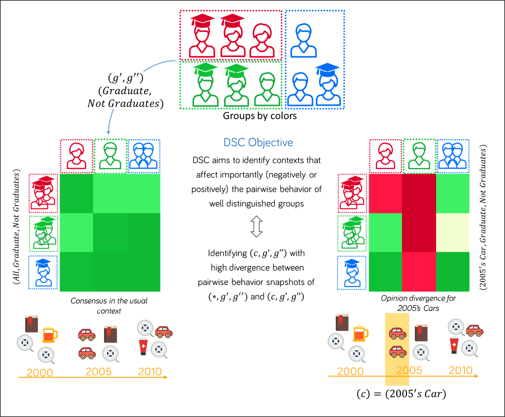

# DiscoveringSimilarityChanges
This repository depict the materials concerning the paper : Flash point : Discovering exceptional pairwise behaviors in votes or ratings data. The repository contains :
1. **PaDMiV** : The project scripts used to generate qualitative and performance experiments
2. **Datasets** : the datasets Movielens (Script) and EPD8 (European parliament Dataset - *8th mandate*) 
3. **Tags of EPD** : contains the details of the tree of tags concerning the dataset EPD8
4. **Qualitative XP** : a set of qualitative experiments and examples of scripts that can be used to reproduce the qualitative experiments results
5. **Performance XP** : a set of performance experiments and examples of scripts that can be used to reproduce the  performance experiments results

Below the method overview:


## 1.  PaDMiV ##

Contains the method (DSC - Discovering Similarities Changes) method scripts and other scripts usefuls to print figures, filtering files ... It contains mainly the two scripts : 

**./main.py** : used to generate qualitative results
**./mainPerf.py** : used to generate performance experiments

Before being able to use the project, please install Anaconda 4.3.1 for python 2.7 which can be found in the following url : **https://www.continuum.io/DOWNLOADS** and run the project using the conda python interpreter. 


## 2.  Datasets ##

The datasets directory contains the following files : 

+ **/transformMovielens.py** : In order to generate the movielens dataset that is usable by our project. Please run the following steps :
    + Download the movielens100K dataset from the following url : `https://grouplens.org/datasets/movielens/100k/`
    + put the script  **/transformMovielens.py** onto the downloaded directory and execute it
    + The scripts returns this file ***movielens_dataset.csv*** that is ready to use by our scripts
+ **/EPD8.csv** : Contains the records of roll call votes during the 8th mandate (last update 17-10-2016). This file is a result of post processing json files downloaded from `parltrack.euwiki.org`. This data is made available under Open Database License whose full text can be found at `http://opendatacommons.org/licenses/odbl/`. Any rights in individual contents of the database are licensed under the Database Contents License whose text can be found `http://opendatacommons.org/licenses/dbcl/`

### 3.  Tags of EPD  ###

The excel file provides details of all the tags by which a ballot can be tagged. This file provide a mapping of tags hierarchical ID with their corresponding labels.

### 4. Qualitative XP ###

The qualitative XP contains a set of experiments and example of scripts that can be used to reproduce qualitative results. First we detail the structure of a *configuration file* that is given as a parameter to the project to run the qualitative results.

```
{
        
        "dataset_file":<dataset source path>,
        "heatmaps": True or False, -- determne whether of not the scripts generate the corrsponding patterns heatmaps
        "dataset_arrayHeader":["attr1","attr2",...], -- specify the columns having an array structure (usually HMT)
        "dataset_numberHeader":["attr3","attr4",...], specify the columns that are numeric

        "items_attributes":["attr1","attr2",...], -- specify the descriptions attribute of an item (e.g. Ballot)
        "users_attributes":["attr3","attr4",...], -- specify the descriptions attribute of a user (e.g. reviewer)
        "outcome_attributes":"attr_outcome", -- specify the column depicting the outcome of a user on an item
        
        "attr_items":[["attr1","type1"],["attr2","type2"]], -- specify the attributes used when enumerating contexts 
        "attr_users":[["attr1","type1"],["attr2","type2"]], -- specify the attributes used when enumerating users  
        "attr_aggregates":["attr1","attr2"], -- specify the grouping attributes
        "sigma_user":<sigma_user>, --specify the threshold on the size of a users subgroup
        "sigma_agg":<sigma_agg>, --specify the threshold on the size ofa group of users
        "sigma_item":<sigma_item>,--specify the threshold on the size of an item subgroup
        "sigma_quality":<sigma_quality>, --specify the threshold over the quality measure
        "top_k":<top_k>, --a number that specify <k> for top-k 
        "similarity_measures":"MAAD" OR "AVG_RANKING_SIMPLE", -- the similariy measure used.
        "quality_measures":"AGR_SUMDIFF" (consent)  or "DISAGR_SUMDIFF" (dissent), -- the quality measure used.
        "upperbound":1 or 2, --specify which upperbound to used over similarities
        "user_1_scope":[stageFilter1,stageFilter2...], --it's a sort of a pipeline that depict U1 the scope of users compared
        "user_2_scope":[stageFilter1,stageFilter2...] --it's a sort of a pipeline that depict U2 the scope of users compared
}
```

In the directory **./QualitativeXP**. We have multiple example of such configuration that can be straightforwardly executed to generate qualitative results. Once a configuration file prepared it can be executed by the project as such 
> python <project_directory>/main.py `config.json`


### 5. Performance XP ###

The qualitative XP contains a set of experiments and example of scripts that can be used to reproduce qualitative results. First we detail the structure of a *configuration file* that is given as a parameter to the project to run the qualitative results.

```
{
        "dataset_file":<dataset source path>,
        "dataset_arrayHeader":["attr1","attr2",...], -- specify the columns having an array structure (usually HMT)
        "dataset_numberHeader":["attr3","attr4",...], specify the columns that are numeric

        "items_attributes":["attr1","attr2",...], -- specify the descriptions attribute of an item (e.g. Ballot)
        "users_attributes":["attr3","attr4",...], -- specify the descriptions attribute of a user (e.g. reviewer)
        "outcome_attributes":"attr_outcome", -- specify the column depicting the outcome of a user on an item

        "attr_items_range":[[["attr1","type1"],["attr2","type2"]], ...], -- specify the attributes used when enumerating contexts. Unlike in qualitative results, here a range is specified that precise that we want to run multiple tests with multiple descriptions attributes 
        "attr_users_range":[[["attr1","type1"],["attr2","type2"]], ...], -- specify the attributes used when enumerating users. Unlike in qualitative results, here a range is specified that precise that we want to run multiple tests with multiple descriptions attributes
        "attr_aggregates_range":[["attr1","attr2"],...], -- specify the range of grouping attributes.
        "nb_items_range":[nb_items1,nb_items2 ...], -- specify the range of the number of items that we want to take into account in DSC.
        "nb_users_range":[nb_users1,nb_users2 ...], -- specify the range of the number of users that we want to take into account in DSC
        "sigma_user_range":[thres1,thres2], -- specify the range of thresholds over the users support size
        "sigma_agg_range":[thres1,thres2], -- specify the range of thresholds over the users aggregates (groups) size
        "sigma_item_range":[thres1,thres2], -- specify the range of thresholds over the items support size
        "sigma_quality_range":[thres1,thres2], -- specify the range of thresholds over the quality measure
        "top_k_range":[5], -- specify the range of thresholds over the quality measure
        "prunning_range":[true (branch and bound),false (no prunning)], -- specify the range of whether or not we want to activate prunning when exploring the search space 
        "closed_range":[true (use closure operator),false (don't use)], -- specify the range of whether or not we want to use the closure operator when exploring the search space
        "similarity_measures":["MAAD","AVG_RANKING_SIMPLE"], -- the similariy measures tested.
        "quality_measures":["DISAGR_SUMDIFF","AGR_SUMDIFF"], -- the quality measures tested.
        "upperbound":[1,2], -- the upperbounds tested tested.
}
```

In the directory **./PerformanceXP**. We have multiple example of such configuration that can be straightforwardly executed to generate performance experiments. Once a configuration file prepared it can be executed by the project as such 
> python <project_directory>/mainPerf.py `config.json`


