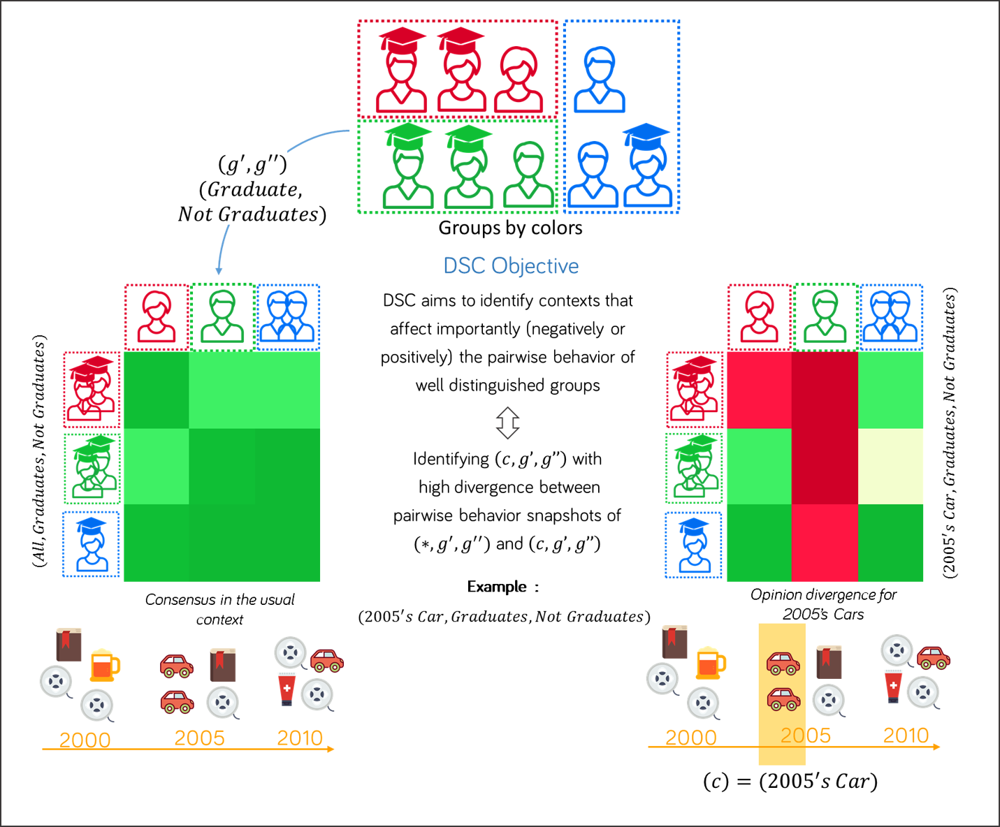

# DiscoveringSimilarityChanges
This repository depict the materials concerning the paper : Flash point : Discovering exceptional pairwise behaviors in votes or ratings data. The repository contains :
1. **PaDMiV** : The project scripts used to generate qualitative and performance experiments
2. **Datasets** : the datasets Movielens (Script) and EPD8 (European parliament Dataset - *8th mandate*) 
3. **Tags of EPD** : contains the details of the tree of tags concerning the dataset EPD8
4. **Qualitative XP** : a set of qualitative experiments and examples of scripts that can be used to reproduce the qualitative experiments results
5. **Performance XP** : a set of performance experiments and examples of scripts that can be used to reproduce the  performance experiments results

Below the method overview:


Not that each individual gives opinion (ratings, votes ...) over items. The groups of individuals can be composed over any users description attributes. Once the groups of individuals composed, an aggregate outcome is mandatory to capture the opinion of a group. For example if we are dealing with a review dataset where people share their opinion over bought items. Let's assume that two of the three red individuals have an opinion gave respectively 3 and 5 on a scale of 5 to a bought car. Then the outcome of the red group can be assimilated to an average of 4 for the same car. These outcomes can be used to compare the opinion between individuals by defining a similarity between them over a subset of items. Finally these similarities help to objectively measure the pairwise behavior change between recomposed groups (after selecting individuals based on a set of constraint (gender, degree ...)) or even colors over a subset of items compared to their usual pairwise behavior observed over the whole items.  

## 1.  PaDMiV ##

Contains the method (DSC - Discovering Similarities Changes) method scripts and other scripts usefuls to print figures, filtering files ... It contains mainly the two scripts : 

**./main.py** : used to generate qualitative results
**./mainPerf.py** : used to generate performance experiments

Before being able to use the project, please install Anaconda 4.3.1 for python 2.7 which can be found in the following url : **https://www.continuum.io/DOWNLOADS** and run the project using the conda python interpreter. 


## 2.  Datasets ##

The datasets directory contains the following files : 

+ **/transformMovielens.py** : In order to generate the movielens dataset that is usable by our project. Please run the following steps :
    + Download the movielens100K dataset from the following url : `https://grouplens.org/datasets/movielens/100k/`
    + put the script  **/transformMovielens.py** onto the downloaded directory and execute it
    + The scripts returns this file ***movielens_dataset.csv*** that is ready to use by our scripts
+ **/EPD8.csv** : Contains the records of roll call votes during the 8th mandate (last update 17-10-2016). This file is a result of post processing json files downloaded from `parltrack.euwiki.org`. This data is made available under Open Database License whose full text can be found at `http://opendatacommons.org/licenses/odbl/`. Any rights in individual contents of the database are licensed under the Database Contents License whose text can be found `http://opendatacommons.org/licenses/dbcl/`

### 3.  Tags of EPD  ###

The excel file provides details of all the tags by which a ballot can be tagged. This file provide a mapping of tags hierarchical ID with their corresponding labels.

### 4. Qualitative XP ###

The qualitative XP contains a set of experiments and example of scripts that can be used to reproduce qualitative results. First we detail the structure of a *configuration file* that is given as a parameter to the project to run the qualitative results.

```
{
        
        "dataset_file":<dataset source path>,
        "heatmaps": True or False, -- determne whether of not the scripts generate the corrsponding patterns heatmaps
        "dataset_arrayHeader":["attr1","attr2",...], -- specify the columns having an array structure (usually HMT)
        "dataset_numberHeader":["attr3","attr4",...], specify the columns that are numeric

        "items_attributes":["attr1","attr2",...], -- specify the descriptions attribute of an item (e.g. Ballot)
        "users_attributes":["attr3","attr4",...], -- specify the descriptions attribute of a user (e.g. reviewer)
        "outcome_attributes":"attr_outcome", -- specify the column depicting the outcome of a user on an item
        
        "attr_items":[["attr1","type1"],["attr2","type2"]], -- specify the attributes used when enumerating contexts 
        "attr_users":[["attr1","type1"],["attr2","type2"]], -- specify the attributes used when enumerating users  
        "attr_aggregates":["attr1","attr2"], -- specify the grouping attributes
        "sigma_user":<sigma_user>, --specify the threshold on the size of a users subgroup
        "sigma_agg":<sigma_agg>, --specify the threshold on the size ofa group of users
        "sigma_item":<sigma_item>,--specify the threshold on the size of an item subgroup
        "sigma_quality":<sigma_quality>, --specify the threshold over the quality measure
        "top_k":<top_k>, --a number that specify <k> for top-k 
        "similarity_measures":"MAAD" OR "AVG_RANKING_SIMPLE", -- the similariy measure used.
        "quality_measures":"AGR_SUMDIFF" (consent)  or "DISAGR_SUMDIFF" (dissent), -- the quality measure used.
        "upperbound":1 or 2, --specify which upperbound to used over similarities
        "user_1_scope":[stageFilter1,stageFilter2...], --it's a sort of a pipeline that depict U1 the scope of users compared
        "user_2_scope":[stageFilter1,stageFilter2...] --it's a sort of a pipeline that depict U2 the scope of users compared
}
```

In the directory **./QualitativeXP**. We have multiple example of such configuration that can be straightforwardly executed to generate qualitative results. Once a configuration file prepared it can be executed by the project as such 
> python <project_directory>/main.py `config.json`


### 5. Performance XP ###

The qualitative XP contains a set of experiments and example of scripts that can be used to reproduce qualitative results. First we detail the structure of a *configuration file* that is given as a parameter to the project to run the qualitative results.

```
{
        "dataset_file":<dataset source path>,
        "dataset_arrayHeader":["attr1","attr2",...], -- specify the columns having an array structure (usually HMT)
        "dataset_numberHeader":["attr3","attr4",...], specify the columns that are numeric

        "items_attributes":["attr1","attr2",...], -- specify the descriptions attribute of an item (e.g. Ballot)
        "users_attributes":["attr3","attr4",...], -- specify the descriptions attribute of a user (e.g. reviewer)
        "outcome_attributes":"attr_outcome", -- specify the column depicting the outcome of a user on an item

        "attr_items_range":[[["attr1","type1"],["attr2","type2"]], ...], -- specify the attributes used when enumerating contexts. Unlike in qualitative results, here a range is specified that precise that we want to run multiple tests with multiple descriptions attributes 
        "attr_users_range":[[["attr1","type1"],["attr2","type2"]], ...], -- specify the attributes used when enumerating users. Unlike in qualitative results, here a range is specified that precise that we want to run multiple tests with multiple descriptions attributes
        "attr_aggregates_range":[["attr1","attr2"],...], -- specify the range of grouping attributes.
        "nb_items_range":[nb_items1,nb_items2 ...], -- specify the range of the number of items that we want to take into account in DSC.
        "nb_users_range":[nb_users1,nb_users2 ...], -- specify the range of the number of users that we want to take into account in DSC
        "sigma_user_range":[thres1,thres2], -- specify the range of thresholds over the users support size
        "sigma_agg_range":[thres1,thres2], -- specify the range of thresholds over the users aggregates (groups) size
        "sigma_item_range":[thres1,thres2], -- specify the range of thresholds over the items support size
        "sigma_quality_range":[thres1,thres2], -- specify the range of thresholds over the quality measure
        "top_k_range":[5], -- specify the range of thresholds over the quality measure
        "prunning_range":[true (branch and bound),false (no prunning)], -- specify the range of whether or not we want to activate prunning when exploring the search space 
        "closed_range":[true (use closure operator),false (don't use)], -- specify the range of whether or not we want to use the closure operator when exploring the search space
        "similarity_measures":["MAAD","AVG_RANKING_SIMPLE"], -- the similariy measures tested.
        "quality_measures":["DISAGR_SUMDIFF","AGR_SUMDIFF"], -- the quality measures tested.
        "upperbound":[1,2], -- the upperbounds tested tested.
}
```

In the directory **./PerformanceXP**. We have multiple example of such configuration that can be straightforwardly executed to generate performance experiments. Once a configuration file prepared it can be executed by the project as such 
> python <project_directory>/mainPerf.py `config.json`


### 6. Example on French parties
Below we show the top 10 flash points (the contexts on where an important pairwise agreement weakening is observed) applied over the french national parties. Here we vary uniquely categories of ballots and we don't vary descriptions over users

| pattern_index | pattern                                                                         | description                                                                                                                                                                                                                                                                                                                                           | quality | upper_bound | dossiers_voted                                                                                                                                                                                                                                                                                                                                                                                                                                                                                                                                                                                                   | 
|---------------|---------------------------------------------------------------------------------|-------------------------------------------------------------------------------------------------------------------------------------------------------------------------------------------------------------------------------------------------------------------------------------------------------------------------------------------------------|---------|-------------|------------------------------------------------------------------------------------------------------------------------------------------------------------------------------------------------------------------------------------------------------------------------------------------------------------------------------------------------------------------------------------------------------------------------------------------------------------------------------------------------------------------------------------------------------------------------------------------------------------------| 
| 0             | [['3.40.16', '6.10.05', '6.20.02', '6.30']]                                     | [['Raw materials', 'Peace preservation, humanitarian and rescue tasks, crisis management', 'Export/import control, trade defence', 'Development cooperation']]                                                                                                                                                                                        | 0.239   | 0.262       | [('Union system for supply chain due diligence self-certification of responsible importers of tin, tantalum and tungsten, their ores, and gold originating in conflict-affected and high-risk areas', 29)]                                                                                                                                                                                                                                                                                                                                                                                                       | 
| 1             | [['6.20.02', '6.30']]                                                           | [['Export/import control, trade defence', 'Development cooperation']]                                                                                                                                                                                                                                                                                 | 0.223   | 0.262       | [('Union system for supply chain due diligence self-certification of responsible importers of tin, tantalum and tungsten, their ores, and gold originating in conflict-affected and high-risk areas', 29), ('Avoiding trade diversion into the EU of certain key medicines. Codification', 1)]                                                                                                                                                                                                                                                                                                                   | 
| 2             | [['6.10.02', '8.70']]                                                           | "[['Common security and defence policy,WEU, NATO', 'Budget of the Union']]"                                                                                                                                                                                                                                                                           | 0.22    | 0.239       | [('Financing the Common Security and Defence Policy', 9)]                                                                                                                                                                                                                                                                                                                                                                                                                                                                                                                                                        | 
| 3             | [['6.20', '6.30']]                                                              | [['Common commercial policy in general', 'Development cooperation']]                                                                                                                                                                                                                                                                                  | 0.205   | 0.262       | [('Union system for supply chain due diligence self-certification of responsible importers of tin, tantalum and tungsten, their ores, and gold originating in conflict-affected and high-risk areas', 29), ('Arrangements for products originating in certain states which are part of the African, Caribbean and Pacific (ACP) Group of States provided for in economic partnership agreements. Recast', 1), ('EC/South Africa Trade, Development and Cooperation Agreement: accession of Croatia to the EU. Protocol', 1), ('Avoiding trade diversion into the EU of certain key medicines. Codification', 1)] | 
| 4             | [['2.40', '3.30.03.04', '3.30.05', '3.30.06', '3.30.20', '3.30.25', '4.60.06']] | "[['Free movement of services, freedom to provide', 'Telecommunication networks', 'Electronic and mobile communications, personal communications', 'Information and communication technologies', 'Trans-European communications networks', 'International information networks and society, internet', ""Consumers' economic and legal interests""]]" | 0.2     | 0.239       | [('Open internet access', 13)]                                                                                                                                                                                                                                                                                                                                                                                                                                                                                                                                                                                   | 
| 5             | [['3.40.05', '6.10.02']]                                                        | "[['Aeronautical industry, aerospace industry', 'Common security and defence policy, WEU, NATO']]"                                                                                                                                                                                                                                                    | 0.19    | 0.257       | [('Space capabilities for European security and defence', 12)]                                                                                                                                                                                                                                                                                                                                                                                                                                                                                                                                                   | 
| 6             | [['3.40', '6.10.02']]                                                           | "[['Industrial policy', 'Common security and defence policy, WEU, NATO']]"                                                                                                                                                                                                                                                                            | 0.181   | 0.277       | [('Space capabilities for European security and defence', 12), ('Impact of developments in European defence markets on the security and defence capabilities in Europe', 4)]                                                                                                                                                                                                                                                                                                                                                                                                                                     | 
| 7             | [['2.40', '3', '4.60.06']]                                                      | "[['Free movement of services, freedom to provide', '-', ""Consumers' economic and legal interests""]]"                                                                                                                                                                                                                                               | 0.18    | 0.239       | [('Open internet access', 13), ('Insurance distribution. Recast', 1)]                                                                                                                                                                                                                                                                                                                                                                                                                                                                                                                                            | 
| 8             | [['3.30.03']]                                                                   | [['-']]                                                                                                                                                                                                                                                                                                                                               | 0.18    | 0.239       | [('Open internet access', 13), ('EU/Morocco Cooperation Agreement: Civil Global Navigation Satellite System (GNSS)', 1)]                                                                                                                                                                                                                                                                                                                                                                                                                                                                                         | 
| 9             | [['2.50.08', '2.80', '3.45.04']]                                                | [['Financial services, financial reporting and auditing', 'Cooperation between administrations', 'Company taxation']]                                                                                                                                                                                                                                 | 0.179   | 0.179       | [('Taxation: scope of the mandatory automatic exchange of information in the EU', 8)]                                                                                                                                                                                                                                                                                                                                                                                                                                                                                                                            | 
                                                                                                                                                                                                                                                                                                                                                                                                                                                                                                                    | 
                                                                                                                                                                                                                                                | 


In the figure above, the left heatmap corresponds to the reference model (usual pairwise behavior) while the right heatmap corresponds to Pattern 0